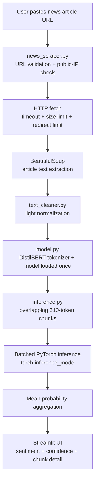

# News Sentiment Analyzer

An end-to-end NLP application that takes a news article URL, scrapes the article text, and classifies its overall sentiment using a pretrained DistilBERT transformer. Articles that exceed DistilBERT's 512-token limit are split into overlapping chunks, each chunk is scored independently, and the per-chunk probabilities are averaged into a single article-level prediction.

An offline evaluation pipeline benchmarks the pretrained model on labeled financial news data and compares it against a classical TF-IDF + Logistic Regression baseline. The transformer is used **as a pretrained inference model only** — no training or fine-tuning was performed on it in this project.

---

## Live Demo

The application is deployed on **Google Cloud** and publicly accessible at:

**➡️ https://35.209.123.193/news/**

The UI is built with Streamlit. The application was previously hosted on Streamlit Community Cloud; the current deployment is on Google Cloud.

---

## Key Features

- Paste any news article URL to get an instant sentiment prediction
- Generic article extraction with `BeautifulSoup4` — not tied to any specific news publisher
- Light text normalization designed for transformer input (no stopword removal, stemming, or lowercasing)
- Pretrained DistilBERT inference with automatic device selection (CUDA → Apple MPS → CPU)
- Model loaded once per session via `@st.cache_resource` to avoid repeated downloads
- Overlapping 510-token chunking with full article coverage, batched inference, and mean-probability aggregation for long articles
- Per-chunk breakdown shown in the UI for transparency
- Offline evaluation pipeline benchmarking the model against a classical baseline on Financial PhraseBank
- URL safeguards in the scraper to prevent misuse (see [Scraper Safeguards](#scraper-safeguards))

---

## How the Application Works



---

## Project Structure

```
.
├── app.py                          # Streamlit entry point; wires modules together
├── requirements.txt
├── .gitignore
├── .streamlit/
│   └── config.toml                 # Streamlit server configuration
│
├── data/
│   └── evaluation/                 # Generated by the evaluation scripts (not committed)
│       ├── financial_phrasebank_full.csv
│       ├── financial_phrasebank_binary.csv
│       ├── dl_results.csv
│       ├── neutral_results.csv
│       ├── test_split.csv
│       ├── ml_results.csv
│       └── model_comparison.csv
│
├── src/
│   ├── __init__.py
│   ├── scraper/
│   │   ├── news_scraper.py         # URL validation, fetching, article extraction
│   │   └── text_cleaner.py         # Whitespace and artifact normalization
│   ├── dl/
│   │   ├── model.py                # Checkpoint + tokenizer loading, device selection
│   │   └── inference.py            # Chunking, batching, aggregation, SentimentResult
│   ├── ml/
│   │   └── baseline.py             # TF-IDF + Logistic Regression offline baseline
│   └── evaluation/
│       ├── prepare_dataset.py      # Dataset download + explicit label mapping
│       ├── evaluate_dl.py          # DistilBERT benchmark + neutral diagnostic
│       └── compare_models.py       # Fair head-to-head on identical held-out rows
│
└── tests/
    ├── test_inference.py
    └── test_scrapper.py
```

---

## Technology Stack

| Layer | Tools |
|---|---|
| Language | Python |
| Deep learning | PyTorch, Hugging Face Transformers |
| Model | `distilbert-base-uncased-finetuned-sst-2-english` (pretrained on SST-2; used for inference only) |
| Scraping | requests, BeautifulSoup4, lxml |
| Classical ML (offline only) | scikit-learn (TF-IDF, Logistic Regression, Pipeline) |
| Data handling | pandas, datasets (Hugging Face) |
| UI framework | Streamlit |
| Deployment | Google Cloud (live); local development via `streamlit run` |

---

## NLP Model

The application uses [`distilbert-base-uncased-finetuned-sst-2-english`](https://huggingface.co/distilbert-base-uncased-finetuned-sst-2-english) from the Hugging Face Hub.

| Property | Value |
|---|---|
| Architecture | DistilBERT (distilled from BERT-base) |
| Original fine-tuning | SST-2 (Stanford Sentiment Treebank — movie reviews) |
| Output classes | `NEGATIVE`, `POSITIVE` |
| Max token length | 512 (positional embedding limit) |
| Usage in this project | Inference only — no training or fine-tuning performed |

The model checkpoint (~255 MB) is downloaded automatically from the Hugging Face Hub on first run and cached locally.

**Important caveat:** The checkpoint was fine-tuned on movie review sentiment (SST-2), not on news text. This domain mismatch affects prediction quality — see [Evaluation Results](#evaluation-results) and [Limitations](#limitations).

---

## Article Scraping

`src/scraper/news_scraper.py` fetches and extracts readable article text from a given URL using `requests` and `BeautifulSoup4`.

**Extraction approach:**

1. The page HTML is downloaded and parsed with the `lxml` parser.
2. Noise elements (`<script>`, `<style>`, `<nav>`, `<footer>`, `<aside>`, `<header>`, `<iframe>`, `<svg>`, `<button>`, `<figcaption>`) are stripped before any text is read.
3. Paragraph (`<p>`) elements are filtered by:
   - Minimum character length (50 chars) to drop captions and menu items
   - Link density threshold (≤35% link characters) to exclude navigation blocks
   - Boilerplate phrase matching (e.g., "subscribe", "all rights reserved", "advertisement") to strip standard publisher chrome
4. If the extracted text is shorter than 300 characters, an `ExtractionError` is raised rather than passing incomplete text to the model.

### Scraper Safeguards

`news_scraper.py` includes several safeguards for a public-facing deployment:

| Safeguard | Detail |
|---|---|
| Scheme validation | Only `http://` and `https://` URLs are accepted |
| Credential blocking | URLs containing embedded credentials (`user:pass@host`) are rejected |
| Port restriction | Only standard ports 80 and 443 are allowed |
| Private IP blocking | The hostname is resolved to IPv4 before the request; any address that is not globally routable (loopback, link-local, RFC 1918, etc.) causes an immediate rejection |
| Redirect limit | Maximum 5 redirects |
| Download size limit | Maximum 2 MB of HTML downloaded |
| Request timeout | 15-second timeout on the HTTP request |
| HTTPS certificate verification | Enabled (requests library default) |

---

## Text Preprocessing

`src/scraper/text_cleaner.py` applies light normalization designed specifically for transformer input.

**What it does:**
- Strips zero-width and invisible Unicode characters (e.g., `\u200b`, `\ufeff`, soft hyphens)
- Maps typographic punctuation to plain ASCII equivalents (curly quotes → straight quotes, em/en dashes → hyphens, ellipsis → `...`, non-breaking spaces → regular spaces)
- Strips Unicode control/format characters while preserving newlines and tabs
- Collapses runs of whitespace and trims leading/trailing whitespace per line

**What it deliberately does not do:**
- No lowercasing
- No stopword removal
- No stemming or lemmatization
- No punctuation stripping

These are intentionally omitted because DistilBERT was pretrained on natural text and its WordPiece tokenizer handles mixed-case and punctuation correctly. Classical preprocessing would degrade its input.

---

## Handling Long Articles

DistilBERT's positional embeddings stop at 512 tokens. A naive implementation truncates everything past that point and discards most of a typical news article.

`src/dl/inference.py` handles this by:

1. **Tokenizing** the full article text once (without truncation).
2. **Sliding a 510-token window** with a 50-token overlap. The remaining two positions are reserved for the `[CLS]` and `[SEP]` special tokens.
3. **Filtering tiny trailing chunks**: any window that would be a fragment under 64 tokens is dropped, and the previous window is slid forward to end on the last token instead — preserving full coverage without creating a near-duplicate chunk that would be double-counted during averaging.
4. **Batching**: chunks are padded and masked per-batch (batch size: 8) and run under `torch.inference_mode()`.
5. **Aggregating**: the per-chunk softmax probability distributions are averaged; the predicted label is the argmax of the mean distribution, and the reported confidence is the mean probability of the winning class.

The overlap preserves sentence context across chunk boundaries. Mean-of-probabilities is used rather than majority voting, so a chunk predicted at 51% confidence is weighted less than one predicted at 99%.

---

## Evaluation Results

The evaluation pipeline (`src/evaluation/`) benchmarks the pretrained model on [Financial PhraseBank](https://huggingface.co/datasets/financial_phrasebank) and compares it against a TF-IDF + Logistic Regression baseline. The pipeline reuses the exact `clean_text → predict_sentiment` path that the application uses, so the benchmark measures the live code.

> **Scope note:** The benchmark uses sentence-level Financial PhraseBank data (average ~23 words/sentence). Accuracy figures here apply to that dataset only. No labeled article-level dataset was used, so no accuracy figure can be claimed for the Streamlit application's chunked predictions on full news articles.

### Dataset: Financial PhraseBank (`sentences_50agree`)

4,846 English sentences from financial news and company press releases.

| Class | Count | Share |
|---|---|---|
| NEUTRAL | 2,879 | 59.4% |
| POSITIVE | 1,363 | 28.1% |
| NEGATIVE | 604 | 12.5% |
| **Total** | **4,846** | |

**Design decisions:**
- Neutral examples are never remapped. Binary metrics use only the 1,967 positive/negative sentences; the 2,879 neutral sentences are analyzed separately as a diagnostic.
- Labels are mapped by name, never by integer index. (Financial PhraseBank: `negative=0, neutral=1, positive=2`; model: `NEGATIVE=0, POSITIVE=1`.) The preparation script aborts if the downloaded class counts do not match published figures exactly.
- DistilBERT is never trained. Only the Logistic Regression baseline is fitted, on a stratified 80/20 split (`random_state=42`) with the TF-IDF vectorizer inside an sklearn `Pipeline` to prevent leakage.
- No hyperparameter tuning, grid search, cross-validation, or threshold optimization was performed.

### DistilBERT — full binary subset (1,967 examples, zero-shot)

| Metric | Score |
|---|---|
| Accuracy | 73.72% |
| Macro Precision | 76.19% |
| Macro Recall | 80.39% |
| Macro F1 | 73.21% |

### Head-to-head — identical 394 held-out examples

Both models scored on the same rows. The 394 rows are the held-out 20% of the 1,967-example binary subset; Logistic Regression was trained on the other 1,573; DistilBERT was not trained at all.

| Metric | TF-IDF + Logistic Regression | DistilBERT (zero-shot) |
|---|---|---|
| Accuracy | **84.77%** | 74.62% |
| Macro Precision | **82.05%** | 76.85% |
| Macro Recall | **82.34%** | 81.22% |
| Macro F1 | **82.19%** | 74.10% |
| Negative Recall | 76.03% | **98.35%** |
| Positive Recall | **88.64%** | 64.10% |

**Confusion matrices** (rows = true, columns = predicted):

TF-IDF + Logistic Regression:

| | Pred NEG | Pred POS |
|---|---|---|
| **True NEG** | 92 | 29 |
| **True POS** | 31 | 242 |

DistilBERT:

| | Pred NEG | Pred POS |
|---|---|---|
| **True NEG** | 119 | 2 |
| **True POS** | 98 | 175 |

**Model disagreement on the 394-example subset:**

| Outcome | Count | Share |
|---|---|---|
| Both correct | 256 | 65.0% |
| Both wrong | 22 | 5.6% |
| ML correct, DistilBERT wrong | 78 | 19.8% |
| DistilBERT correct, ML wrong | 38 | 9.6% |
| **Predictions that differ** | **116** | **29.4%** |

### Neutral Diagnostic

Financial PhraseBank contains 2,879 neutral sentences. Since the checkpoint cannot output NEUTRAL, no accuracy is reported for these. The distribution of forced predictions was measured:

| Measure | Value |
|---|---|
| Predicted NEGATIVE | 1,406 (48.8%) |
| Predicted POSITIVE | 1,473 (51.2%) |
| Mean confidence | 92.49% |
| Median confidence | 98.14% |
| Confidence ≥ 90% | 76.4% |
| Confidence ≥ 95% | 65.4% |

The model produced high-confidence predictions on sentences where no correct binary answer existed. **Softmax confidence is therefore not a calibrated probability of correctness**, and the application labels it as "model confidence" accordingly.

### Key Findings

1. **Domain alignment mattered more than model capacity.** An untuned linear model trained on 1,573 in-domain sentences outperformed a 66M-parameter transformer applied zero-shot by 10.15 accuracy points and 8.09 macro-F1 points. This compares in-domain supervised training against zero-shot transfer — not classical ML against transformers in general. Fine-tuning DistilBERT on the same split would be the like-for-like comparison; that was deliberately not done, since the goal was to evaluate the pretrained checkpoint honestly rather than maximize a score.

2. **The pretrained model's errors are systematic and directional.** DistilBERT reached 98.35% recall on negatives but only 64.10% on positives, calling 98 positive sentences negative against only 2 errors the other way. Financial positives are often understated ("operating profit rose to EUR 12.3 mn") or contain tokens that read as negative in general English ("cut costs", "loss narrowed") — consistent with a decision boundary calibrated for movie-review tone rather than business impact.

3. **The neutral diagnostic rules out a simple negative prior.** Neutral sentences split almost evenly (48.8% / 51.2%), so the bias is specific to understated positives rather than a blanket default on unfamiliar text.

4. **Neither model dominates.** They disagreed on 29.4% of examples, with DistilBERT uniquely correct on 9.6% — the errors are partly complementary.

---

## Dataset Reference

**Financial PhraseBank** — Malo, P., Sinha, A., Korhonen, P., Wallenius, J., & Takala, P. (2014). *Good debt or bad debt: Detecting semantic orientations in economic texts.* Journal of the Association for Information Science and Technology, 65(4).

- Configuration used: `sentences_50agree` (4,846 sentences)
- Labels: negative, neutral, positive
- Licence: CC BY-NC-SA 3.0 (non-commercial)

Loaded from a Parquet mirror on the Hugging Face Hub, since the original script-based dataset repository is not loadable with current versions of the `datasets` library. The preparation script verifies the downloaded class counts against the published figures and refuses to write any files if they do not match.

---

## Local Installation

```bash
git clone https://github.com/tanaymahapatra/news-sentiment-analyzer
cd news-sentiment-analyzer

python -m venv venv
source venv/bin/activate        # Windows: venv\Scripts\activate

pip install -r requirements.txt
```

The DistilBERT checkpoint (~255 MB) downloads automatically from the Hugging Face Hub on first run and is cached locally for subsequent runs.

---

## Running Locally

**Streamlit application:**

```bash
streamlit run app.py
```

Opens at `http://localhost:8501`. Paste a news article URL and click **Analyze**.

**Offline evaluation pipeline** (run in order from the project root):

```bash
python -m src.evaluation.prepare_dataset    # download + label mapping
python -m src.evaluation.evaluate_dl        # DistilBERT benchmark + neutral diagnostic
python -m src.ml.baseline                   # train + evaluate classical baseline
python -m src.evaluation.compare_models     # fair head-to-head comparison
```

`prepare_dataset` must run first; the others read the CSV files it writes. `compare_models` requires `baseline` to have written the held-out split.

---

## Deployment

| Environment | How to access |
|---|---|
| **Live (Google Cloud)** | https://35.209.123.193/news/ |
| **Local development** | `streamlit run app.py` → `http://localhost:8501` |

The application is built with Streamlit and deployed on Google Cloud. The deployment did not change the sentiment model or retrain it in any way.

---

## Limitations

- **No neutral class.** Neutral or purely factual reporting is forced into POSITIVE or NEGATIVE; most news writing is neutral. The neutral diagnostic above shows the model is highly confident even when it has no correct binary answer.
- **Benchmark is sentence-level; the application is article-level.** Financial PhraseBank sentences average ~23 words and fit in one chunk. The accuracy figures in this README apply only to that benchmark and not to the application's chunked predictions on full news articles.
- **The checkpoint is out of domain for news.** It was fine-tuned on SST-2 movie reviews. Financial PhraseBank labels reflect an investor's view of business impact, while SST-2 labels reflect a writer's expressed opinion — related but different tasks. General-interest news introduces additional domain shift.
- **The baseline is offline only.** Trained on financial press-release text, the TF-IDF + Logistic Regression baseline is deliberately not used for live predictions, since the application accepts general news where it would itself be out of domain. Its 84.77% does not apply to the application.
- **Single stratified split.** Baseline results come from one 80/20 split with a fixed seed and would vary with another seed.
- **Scraping is best-effort.** Many news publishers block automated requests, serve JavaScript-rendered content, sit behind paywalls, or return content only with session cookies. These are expected limitations of HTML-based scraping and are not failures of the sentiment model. The scraper reports a clear, specific error in these cases rather than passing partial text to the model.
- **Confidence is not calibrated.** See the neutral diagnostic above. High softmax confidence does not imply a high probability that the prediction is correct.

---

## Future Improvements

- Fine-tune a transformer on in-domain data (financial or news text) for a like-for-like comparison against the classical baseline
- Use a sentiment model with a neutral class, which better matches how most news is written
- Build or source a labeled article-level dataset to directly evaluate the chunking and aggregation logic
- Improve article extraction for publishers that block plain HTTP requests or require JavaScript rendering
- Compare alternative chunk aggregation strategies, such as length-weighted averaging of chunk probabilities
