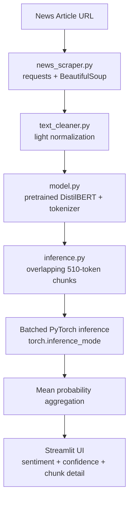

# Live News Sentiment Analyzer

An end-to-end NLP application that takes a news article URL, extracts the article text, and classifies its sentiment with a pretrained DistilBERT model. Articles longer than DistilBERT's 512-token limit are split into overlapping chunks, scored individually, and aggregated into one article-level prediction. An offline evaluation pipeline benchmarks the pretrained model on labeled data and compares it against a classical TF-IDF + Logistic Regression baseline.

The transformer is used **as a pretrained inference model only** — no training or fine-tuning was performed on it.

---

## Key Features

- Generic article extraction with BeautifulSoup — not tied to any one news site
- Light normalization designed for transformer input rather than classical preprocessing
- PyTorch inference with automatic CUDA/MPS/CPU device selection and Streamlit model caching
- Overlapping 510-token chunking with full token coverage, batched inference, mean-probability aggregation
- Offline benchmark on Financial PhraseBank with per-class metrics, confusion matrices and a neutral diagnostic
- Leakage-free classical baseline and a like-for-like comparison on identical held-out rows

---

## Architecture



The evaluation pipeline runs offline and reuses the exact same `clean_text` → `predict_sentiment` path as the application.

---

## Project Structure

```
.
├── app.py                          # Streamlit interface
├── requirements.txt
├── .gitignore
├── .streamlit/
│   └── config.toml
│
├── data/
│   └── evaluation/                 # generated by the scripts below
│       ├── financial_phrasebank_full.csv
│       ├── financial_phrasebank_binary.csv
│       ├── dl_results.csv
│       ├── neutral_results.csv
│       ├── test_split.csv
│       ├── ml_results.csv
│       └── model_comparison.csv
│
├── src/
│   ├── __init__.py
│   ├── scraper/
│   │   ├── __init__.py
│   │   ├── news_scraper.py         # URL validation, fetching, article extraction
│   │   └── text_cleaner.py         # whitespace/artifact normalization
│   ├── dl/
│   │   ├── __init__.py
│   │   ├── model.py                # checkpoint + tokenizer loading, device selection
│   │   └── inference.py            # chunking, batching, aggregation
│   ├── ml/
│   │   ├── __init__.py
│   │   └── baseline.py             # TF-IDF + Logistic Regression baseline
│   └── evaluation/
│       ├── __init__.py
│       ├── prepare_dataset.py      # dataset download + explicit label mapping
|       ├── evaluate_dl.py          # DistilBERT benchmark + neutral diagnostic
│       └── compare_models.py       # fair head-to-head on identical rows

```

---

## Tech Stack

| Layer | Tools |
|---|---|
| Language | Python |
| Deep learning | PyTorch, Hugging Face Transformers |
| Model | `distilbert-base-uncased-finetuned-sst-2-english` (pretrained, not fine-tuned here) |
| Scraping | requests, BeautifulSoup4, lxml |
| Classical ML | scikit-learn (TF-IDF, Logistic Regression, Pipeline) |
| Data | pandas, datasets |
| Interface | Streamlit |

---

## Handling Long Articles

DistilBERT's positional embeddings stop at 512 tokens, so a naive implementation truncates everything past that point and discards most of a typical news article.

This project instead:

1. Tokenizes the full article once, then slides a **510-token window** with a **50-token overlap** (`[CLS]` and `[SEP]` take the remaining two positions).
2. Discards any trailing window already fully covered by the previous one. If the final window would be a fragment under 64 tokens, the previous window is slid forward to end on the last token instead — this keeps full coverage without adding a near-duplicate chunk that would be double-counted during averaging.
3. Pads per batch, builds attention masks, and runs batches of 8 under `torch.inference_mode()`.
4. Averages the per-chunk probability distributions; the label is the argmax and the confidence is that class's mean probability.

Overlap preserves context across chunk boundaries. Mean-of-probabilities is used rather than majority voting so a chunk predicted at 51% does not count the same as one predicted at 99%.

---

## Evaluation Methodology

**Dataset:** Financial PhraseBank (`sentences_50agree`) — 4,846 English sentences from financial news and company press releases.

| Class | Count | Share |
|---|---|---|
| NEUTRAL | 2,879 | 59.4% |
| POSITIVE | 1,363 | 28.1% |
| NEGATIVE | 604 | 12.5% |
| **Total** | **4,846** | |

Design decisions:

- **Neutral examples are never remapped.** Binary metrics use only the 1,967 positive/negative sentences; the 2,879 neutral sentences are analyzed separately as a diagnostic.
- **Labels are mapped by name, never by index.** Financial PhraseBank orders labels `negative=0, neutral=1, positive=2`; the model orders them `NEGATIVE=0, POSITIVE=1`. The preparation script writes nothing if the downloaded class counts do not match the published figures exactly.
- **Evaluation reuses the application's inference path** (`clean_text` → `predict_sentiment`), so the benchmark measures the code the app actually runs.
- **DistilBERT is never trained.** Only the baseline is fitted, on a stratified 80/20 split (`random_state=42`) with the TF-IDF vectorizer inside an sklearn `Pipeline` so it never sees test data.
- **No tuning.** No grid search, cross-validation, threshold optimization or resampling.

---

## Results

### DistilBERT — full binary subset (1,967 examples)

Zero-shot, no fine-tuning.

| Metric | Score |
|---|---|
| Accuracy | 73.72% |
| Macro Precision | 76.19% |
| Macro Recall | 80.39% |
| Macro F1 | 73.21% |

### Head-to-head — identical 394 held-out examples

Both models scored on exactly the same rows, matched by `row_id`. The 394 rows are the held-out 20% of the 1,967-example binary subset; Logistic Regression was trained on the other 1,573 and DistilBERT was not trained at all.

| Metric | TF-IDF + Logistic Regression | DistilBERT (zero-shot) |
|---|---|---|
| Accuracy | **84.77%** | 74.62% |
| Macro Precision | **82.05%** | 76.85% |
| Macro Recall | **82.34%** | 81.22% |
| Macro F1 | **82.19%** | 74.10% |
| Negative Recall | 76.03% | **98.35%** |
| Positive Recall | **88.64%** | 64.10% |

**Confusion matrices** (rows = true, columns = predicted):

TF-IDF + Logistic Regression

| | Pred NEG | Pred POS |
|---|---|---|
| **True NEG** | 92 | 29 |
| **True POS** | 31 | 242 |

DistilBERT

| | Pred NEG | Pred POS |
|---|---|---|
| **True NEG** | 119 | 2 |
| **True POS** | 98 | 175 |

### Model disagreement

| Outcome | Count | Share |
|---|---|---|
| Both correct | 256 | 65.0% |
| Both wrong | 22 | 5.6% |
| ML correct, DistilBERT wrong | 78 | 19.8% |
| DistilBERT correct, ML wrong | 38 | 9.6% |
| **Predictions that differ** | **116** | **29.4%** |

---

## Neutral Diagnostic

Financial PhraseBank contains 2,879 neutral sentences. Since the checkpoint cannot output NEUTRAL, no accuracy is reported for these. Instead, the distribution of forced predictions was measured:

| Measure | Value |
|---|---|
| Predicted NEGATIVE | 1,406 (48.8%) |
| Predicted POSITIVE | 1,473 (51.2%) |
| Mean confidence | 92.49% |
| Median confidence | 98.14% |
| Confidence ≥ 90% | 76.4% |
| Confidence ≥ 95% | 65.4% |

The model produced high-confidence predictions on sentences where no correct binary answer existed. **Softmax confidence is therefore not a calibrated probability of correctness**, and the application labels it as "model confidence" accordingly.

---

## Key Findings

**1. Domain alignment mattered more than model capacity here.** An untuned linear model trained on 1,573 in-domain sentences beat a 66M-parameter transformer applied out-of-domain by 10.15 accuracy points and 8.09 macro-F1 points. This compares in-domain supervised training against zero-shot transfer, not classical ML against transformers. A DistilBERT fine-tuned on the same split would be the like-for-like comparison; that was deliberately not done, since the goal was to evaluate the pretrained checkpoint honestly rather than maximize a score.

**2. The pretrained model's errors are systematic and directional.** DistilBERT reached 98.35% recall on negatives but 64.10% on positives, calling 98 positive sentences negative against only 2 errors the other way. Its positive predictions were highly precise (98.87%), so it fires POSITIVE only for overtly positive language and otherwise defaults to NEGATIVE. Financial positives are often understated ("operating profit rose to EUR 12.3 mn") or contain tokens that read as negative in general English ("cut costs", "loss narrowed") — consistent with a boundary calibrated for movie-review tone rather than business impact.

**3. The neutral diagnostic rules out a simple negative prior.** Neutral sentences split almost evenly (48.8% / 51.2%), so the bias is specific to understated positives rather than a blanket default on unfamiliar text.

**4. Neither model dominates.** They disagreed on 29.4% of examples, with DistilBERT uniquely correct on 9.6% — the errors are partly complementary.

---

## Limitations

- **No neutral class.** Neutral or purely factual reporting is still forced into POSITIVE or NEGATIVE, and most news writing is neutral.
- **The benchmark is sentence-level; the application is article-level.** Financial PhraseBank sentences average ~23 words and fit in one chunk. **No accuracy figure in this README applies to the Streamlit application's predictions** — the chunking and aggregation logic has not been benchmarked, as no labeled article-level dataset was used.
- **The checkpoint is out of domain for news.** It was fine-tuned on SST-2 movie reviews. Financial PhraseBank labels also reflect an investor's view of business impact, while SST-2 labels reflect a writer's expressed opinion — related but different tasks.
- **The baseline is offline only.** Trained on financial press-release text, it is deliberately not used for live predictions, since the app accepts general news where it would itself be out of domain. Its 84.77% does not apply to the app.
- **Single stratified split.** Baseline results come from one 80/20 split with a fixed seed and would vary somewhat with another.
- **Scraping is best-effort.** Many news sites block automated requests or require JavaScript; the scraper reports a clear error rather than returning partial text.
- **Confidence is not calibrated.** See the neutral diagnostic above.

---

## Installation

```bash
git clone https://github.com/tanaymahapatra/live-news-sentiment-analyzer
cd live-news-sentiment-analyzer

python -m venv venv
source venv/bin/activate        # Windows: venv\Scripts\activate

pip install -r requirements.txt
```

The DistilBERT checkpoint (~255 MB) downloads automatically from the Hugging Face Hub on first run and is cached locally for subsequent runs.

---

## Running Locally

**Streamlit application:**

```bash
streamlit run app.py
```

Opens at `http://localhost:8501`.

**Evaluation pipeline** (run in order, from the project root):

```bash
python -m src.evaluation.prepare_dataset    # download + label mapping
python -m src.evaluation.evaluate_dl        # DistilBERT benchmark + neutral diagnostic
python -m src.ml.baseline                   # train + evaluate classical baseline
python -m src.evaluation.compare_models     # fair head-to-head comparison
```

`prepare_dataset` must run first; the others read the CSVs it writes. `compare_models` requires `baseline` to have written the held-out split.

---

## Example Usage

Paste a news article URL and click **Analyze**. The app shows the article title, predicted sentiment, model confidence, positive and negative probabilities, chunk and token counts, a text preview, and a per-chunk breakdown.

For long articles the chunk table lists each chunk's own prediction and confidence. When chunks disagree, the app notes that different sections carry different sentiment and that the reported result is their average.

Some news sites block automated requests; those URLs return a clear error rather than a prediction.

---

## Dataset

**Financial PhraseBank** — Malo, P., Sinha, A., Korhonen, P., Wallenius, J., & Takala, P. (2014). *Good debt or bad debt: Detecting semantic orientations in economic texts.* Journal of the Association for Information Science and Technology, 65(4).

- Configuration used: `sentences_50agree` (4,846 sentences)
- Labels: negative, neutral, positive
- Licence: CC BY-NC-SA 3.0 (non-commercial)

Loaded from a parquet mirror on the Hugging Face Hub, since the original script-based dataset repository is not loadable with current versions of the `datasets` library. The preparation script verifies the downloaded class counts against the published figures and refuses to write any files if they do not match.

---

## Future Improvements

- Fine-tune a transformer on in-domain data for a like-for-like comparison against the classical baseline
- Use a sentiment model with a neutral class, which better matches how most news is written
- Build or source a labeled article-level dataset to evaluate the chunking and aggregation logic directly
- Improve article extraction for sites that block plain HTTP requests
- Compare alternative aggregation strategies, such as length-weighted averaging of chunk probabilities
